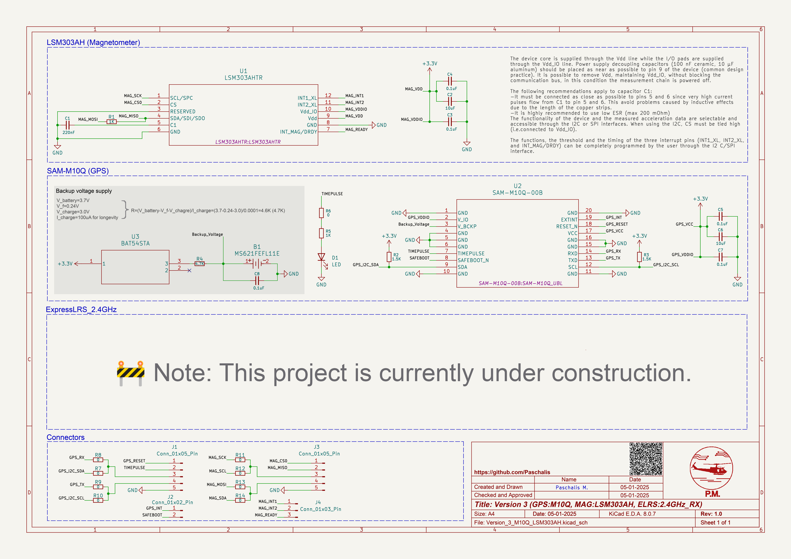

# FC Plus Sensor Module

  

**FC Plus** is a modular add-on board designed for UAV flight controllers, providing advanced telemetry, GPS, object avoidance (ToF, Sonar, IR), and LED indicators for status feedback. This repository contains the necessary documentation, hardware setup guides, sensor integration instructions, and communication protocols (LoRa/WiFi) to enhance UAV autonomy and safety.

## Related Projects

**Autonomous UAVs: MAVLink Communication Between FCs and SBCs**: This repository explores MAVLink communication between flight controllers and SBCs, enabling UAV autonomy with features like peripheral integration and real-time image processing.

  

Explore more about the **MAVLink Communication Between FCs and SBCs** project and its integration into autonomous UAVs by clicking on the badge above to access the full documentation and setup guide.

## Contributing

Your contributions and suggestions are crucial for the improvement of this project!  Feel free to submit pull requests or open issues if you encounter any problems.

## License

This project is licensed under the [GPLv3 License](https://opensource.org/licenses/GPL-3.0) - see the [LICENSE](LICENSE) file for details.

---

**Thank you for visiting fc-plus-sensor-module!**
