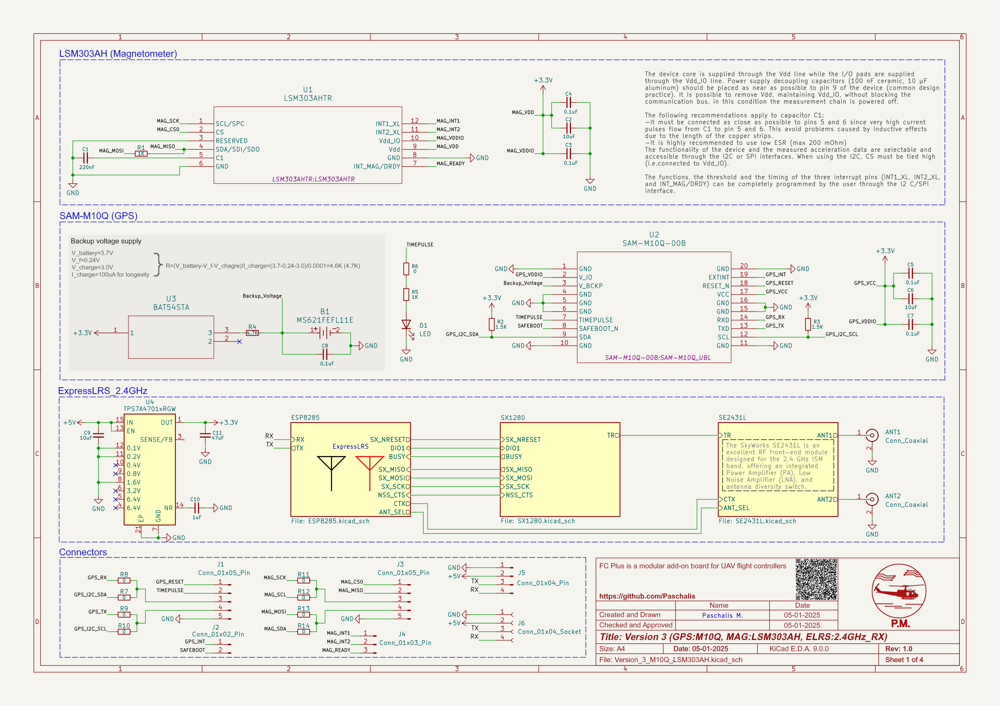
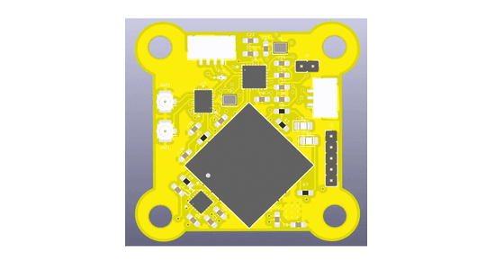
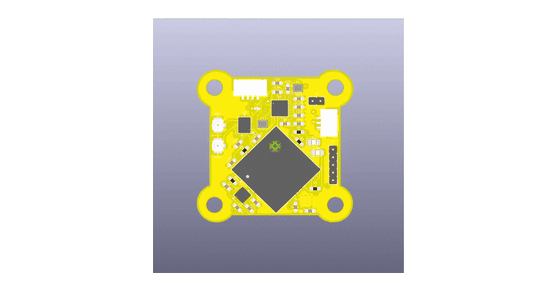
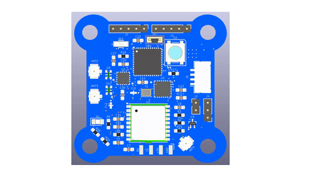

# FC Plus Sensor Module

  

  

**FC Plus** is a modular add-on board designed for UAV flight controllers, providing advanced telemetry, GPS, object avoidance (ToF, Sonar, IR), and LED indicators for status feedback. This repository contains the necessary documentation, hardware setup guides, sensor integration instructions, and communication protocols (LoRa/WiFi) to enhance UAV autonomy and safety.

# Board Designs Overview

This repository contains a collection of **FC Plus Sensor Modules Boards** categorized by their transmission modes. More details about the transmission modes can be found in the [Transmission Modes Classification](SensorFCPlus/README.md).

> **Note:** The PCB colors are used to visually distinguish the boards. The **Antenna Diversity** boards feature **yellow** PCBs, while the **True Diversity** boards are **blue**. The **Gemini Mode** boards are marked with **red** PCBs, and the **Gemini Xrossband (GemX)** boards are designed with **purple** PCBs for easy identification.

    

## 1. Antenna Diversity Boards (Yellow Boards)

### FC Plus Sensor Modules Boards at 2.4GHz

| Name            | Features                                                        | Preview                                                       |
|-----------------|-----------------------------------------------------------------|---------------------------------------------------------------|
| V1-M10Q-HMC     | GPS: SAM-M10Q, MAG: HMC5883L, ELRS: 2.4GHz RX                   |  
 Click on the image to view the files 
|
| V2-M10Q-QMC     | GPS: SAM-M10Q, MAG: QMC5883L, ELRS: 2.4GHz RX                   |  
 Click on the image to view the files 
|
| V3-M10Q-LSM     | GPS: SAM-M10Q, MAG: LSM303AH, ELRS: 2.4GHz RX                   |  
 Click on the image to view the files 
 |

### FC Plus Sensor Modules Boards at 900MHz

Click to view Antenna Diversity Boards at 900MHz

| Name            | Features                                                        | Preview                                                       |
|-----------------|-----------------------------------------------------------------|---------------------------------------------------------------|
| V1-M10Q-HMC     | GPS: SAM-M10Q, MAG: HMC5883L, ELRS: 900MHz RX                   |  |
| V2-M10Q-QMC     | GPS: SAM-M10Q, MAG: QMC5883L, ELRS: 900MHz RX                   |  |
| V3-M10Q-LSM     | GPS: SAM-M10Q, MAG: LSM303AH, ELRS: 900MHz RX                   |  |

---
> **Note:** In the following boards, the **LSM303AH** magnetometer was selected over other options due to its **better overall performance**, offering improved accuracy and reliability in magnetic field sensing. The **MAX-M10S** GPS module was chosen instead of the SAM-M10Q for its **lower cost** while still providing good performance for navigation, making it a more economical choice for the boards.

## 2. True Diversity Boards (Blue Boards)

### FC Plus Sensor Modules Boards at 2.4GHz
| Name            | Features                                                        | Preview                                                       |
|-----------------|-----------------------------------------------------------------|---------------------------------------------------------------|
| TD-M10S-LSM     | GPS: MAX-M10S, MAG: LSM303AH, ELRS: 2.4GHz RX                   |  
 Click on the image to view the files 
|

### FC Plus Sensor Modules Boards at 900MHz

Click to view True Diversity Boards at 900MHz

| Name            | Features                                                        | Preview                                                       |
|-----------------|-----------------------------------------------------------------|---------------------------------------------------------------|
| TD-M10S-LSM     | GPS: MAX-M10S, MAG: LSM303AH, ELRS: 900MHz RX                   |  |

## 3. Gemini Mode Boards

> **Note:**  
> - The **Gemini boards** are actually the **True Diversity boards** operating in **Gemini Mode**.  
> - To enable **Gemini Mode**, set the **RX Antenna Mode** to **Gemini** via Lua script.  
> - **Single Antenna RX boards** can also operate in Gemini Mode but must use **Model 5** in **Model Config Matching** via Lua script.  
> - **Gemini-capable receivers** should use **Model 6** in **Model Config Matching**.  
> - Click on [🔗 **Go to True Diversity Full Diversity Boards (Blue Boards)**](#2-true-diversity-boards-blue-boards) to view compatible receivers.  
>  
> 📖 **Reference:** [ExpressLRS Gemini Mode Documentation](https://www.expresslrs.org/software/gemini/#what-is-gemini)  

## 4. Gemini Xrossband (GemX) Boards (Purple Boards)

### FC Plus Sensor Modules Boards
| Name            | Features                                                        | Preview                                                       |
|-----------------|-----------------------------------------------------------------|---------------------------------------------------------------|
| GemX-M10S-LSM     | GPS: MAX-M10S, MAG: LSM303AH, ELRS: 2.4GHz and 900MHz RX      |  |

## Related Projects

### **Autonomous UAVs: MAVLink Communication Between FCs and SBCs**
This repository explores MAVLink communication between flight controllers and SBCs, enabling UAV autonomy with features like peripheral integration and real-time image processing.

             
  

Explore more about the **MAVLink Communication Between FCs and SBCs** project and its integration into autonomous UAVs by clicking on the badge above to access the full documentation and setup guide.

### **Custom RX/TX Board Designs for GCS Communication**

This repository provides a receiver and transmitter solution for Ground Control Stations (GCS), designed to provide reliable telemetry and control using ELRS, mLRS, and MAVLink protocols. Featuring board designs optimized for long-range communication, minimal latency, and robust performance under varying conditions, these boards cater to diverse operational needs for UAV telemetry systems.

                              
  

Explore the **Custom RX/TX Board Designs for GCS Communication** project and its integration into UAV telemetry systems by clicking on the badge above.

## Contributing

Your contributions and suggestions are crucial for the improvement of this project!  Feel free to submit pull requests or open issues if you encounter any problems.

## License

This project is licensed under the [GPLv3 License](https://opensource.org/licenses/GPL-3.0) - see the [LICENSE](LICENSE) file for details.

---

**Thank you for visiting fc-plus-sensor-module!**
