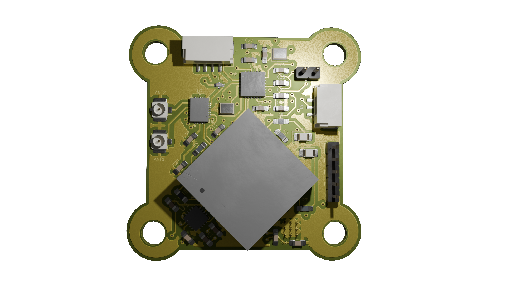

# V1-M10Q-HMC

Antenna Diversity 
(GPS: SAM-M10Q, MAG: HMC5883L, ELRS:2.4GHz_RX)

## Bill of Materials

| Reference          | Value               | Datasheet                                                                 | Footprint                                                                                                      | Qty | DNP |
|--------------------|---------------------|---------------------------------------------------------------------------|---------------------------------------------------------------------------------------------------------------|-----|-----|
| AE1                | Antenna             | N/A                                                                       | RF_Antenna:Texas_SWRA117D_2.4GHz_Right                                                                        | 1   |     |
| ANT1, ANT2         | Conn_Coaxial        | N/A                                                                       | Connector_Coaxial:U.FL_Hirose_U.FL-R-SMT-1_Vertical                                                           | 2   |     |
| B1                 | MS621FEFL11E        | [Datasheet](MS621FEFL11E)                                                 | MS621FE-FL11E:MS621FE-FL11E                                                                                   | 1   |     |
| C1, C4, C6...      | 0.1uF               | N/A                                                                       | Capacitor_SMD:C_0805_2012Metric_Pad1.18x1.45mm_HandSolder                                                     | 6   |     |
| C2                 | 0.22uF              | N/A                                                                       | Capacitor_SMD:C_0805_2012Metric_Pad1.18x1.45mm_HandSolder                                                     | 1   |     |
| C3                 | 4.7uF               | N/A                                                                       | Capacitor_SMD:C_0805_2012Metric_Pad1.18x1.45mm_HandSolder                                                     | 1   |     |
| C5, C7, C14, C21   | 10uF                | N/A                                                                       | Capacitor_SMD:C_0805_2012Metric_Pad1.18x1.45mm_HandSolder, ECASD40J106M055K00:ECASD40J106M055K00              | 4   |     |
| C8                 | 1uF                 | N/A                                                                       | Capacitor_SMD:C_0805_2012Metric_Pad1.18x1.45mm_HandSolder                                                     | 1   |     |
| C9                 | 47uF                | N/A                                                                       | Capacitor_SMD:C_0805_2012Metric_Pad1.18x1.45mm_HandSolder                                                     | 1   |     |
| C10, C11, C16...   | 100nF               | N/A                                                                       | Capacitor_SMD:C_0805_2012Metric_Pad1.18x1.45mm_HandSolder                                                     | 10  |     |
| C22, C23, C30, C31 | 10pF                | N/A                                                                       | Capacitor_SMD:C_0805_2012Metric_Pad1.18x1.45mm_HandSolder                                                     | 4   |     |
| C25, C26           | 10nF                | N/A                                                                       | Capacitor_SMD:C_0805_2012Metric_Pad1.18x1.45mm_HandSolder                                                     | 2   |     |
| C27                | 470nF               | N/A                                                                       | Capacitor_SMD:C_0805_2012Metric_Pad1.18x1.45mm_HandSolder                                                     | 1   |     |
| C29                | 2.2uF               | N/A                                                                       | Capacitor_SMD:C_0805_2012Metric_Pad1.18x1.45mm_HandSolder                                                     | 1   |     |
| D1, D2             | LED                 | N/A                                                                       | LED_SMD:LED_0805_2012Metric_Pad1.15x1.40mm_HandSolder                                                         | 2   |     |
| FL1                | 2450FM07D0034T      | [Datasheet](https://www.mouser.co.uk/datasheet/2/611/2450FM07D0034-1375634.pdf) | 2450FM07D0034T:2450FM07D0034T                                                                                 | 1   |     |
| J1                 | Conn_01x05_Pin      | N/A                                                                       | Connector_PinHeader_2.00mm:PinHeader_1x05_P2.00mm_Vertical                                                    | 1   |     |
| J2                 | Conn_01x02_Pin      | N/A                                                                       | Connector_PinHeader_2.00mm:PinHeader_1x02_P2.00mm_Vertical                                                    | 1   |     |
| J3                 | Conn_01x03_Socket   | N/A                                                                       | Connector_JST:JST_GH_SM03B-GHS-TB_1x03-1MP_P1.25mm_Horizontal                                                 | 1   |     |
| J5                 | Conn_01x04_Pin      | N/A                                                                       | Connector_JST:JST_GH_SM04B-GHS-TB_1x04-1MP_P1.25mm_Horizontal                                                 | 1   |     |
| J6                 | Conn_01x04_Socket   | N/A                                                                       | Connector_Harwin:Harwin_M20-89004xx_1x04_P2.54mm_Horizontal                                                   | 1   |     |
| JP1                | Jumper_2_Bridged    | N/A                                                                       | Jumper:SolderJumper-2_P1.3mm_Open_RoundedPad1.0x1.5mm                                                         | 1   |     |
| R1, R2, R8, R9     | 1.5K                | N/A                                                                       | Resistor_SMD:R_0805_2012Metric_Pad1.20x1.40mm_HandSolder                                                      | 4   |     |
| R3, R6, R18...     | 0                   | N/A                                                                       | Resistor_SMD:R_0603_1608Metric_Pad0.98x0.95mm_HandSolder, Resistor_SMD:R_0805_2012Metric_Pad1.20x1.40mm_HandSolder | 8   |     |
| R4                 | 4.7K                | N/A                                                                       | Resistor_SMD:R_0805_2012Metric_Pad1.20x1.40mm_HandSolder                                                      | 1   |     |
| R5, R7             | 1K                  | N/A                                                                       | Resistor_SMD:R_0805_2012Metric_Pad1.20x1.40mm_HandSolder                                                      | 2   |     |
| R10, R11, R12...   | 10K                 | N/A                                                                       | Resistor_SMD:R_0805_2012Metric_Pad1.20x1.40mm_HandSolder                                                      | 5   |     |
| R14                | 12K                 | N/A                                                                       | Resistor_SMD:R_0805_2012Metric_Pad1.20x1.40mm_HandSolder                                                      | 1   |     |
| R15                | 2.2K                | N/A                                                                       | Resistor_SMD:R_0805_2012Metric_Pad1.20x1.40mm_HandSolder                                                      | 1   |     |
| R16                | 1.2K                | N/A                                                                       | Resistor_SMD:R_0805_2012Metric_Pad1.20x1.40mm_HandSolder                                                      | 1   |     |
| U1                 | HMC5883L            | [Datasheet](HMC5883L)                                                     | HMC5883L:LPCC16_HNW                                                                                           | 1   |     |
| U2                 | SAM-M10Q-00B        | [Datasheet](SAM-M10Q-00B)                                                 | SAM-M10Q-00B:SAM-M10Q_UBL                                                                                     | 1   |     |
| U3                 | BAT54STA            | [Datasheet](BAT54STA)                                                     | BAT54STA:BAT54STA                                                                                             | 1   |     |
| U4                 | TPS7A4701xRGW       | [Datasheet](https://www.ti.com/lit/ds/symlink/tps7a47.pdf)               | Package_DFN_QFN:Texas_RGW0020A_VQFN-20-1EP_5x5mm_P0.65mm_EP3.15x3.15mm_ThermalVias                            | 1   |     |
| U5                 | ESP8285H16          | [Datasheet](ESP8285H16)                                                   | ESP8285H16:QFN32_5X5_EXP                                                                                      | 1   |     |
| U6                 | SX1280IMLTRT       | [Datasheet](SX1280IMLTRT)                                                | SX1280IMLTRT:QFN24_4X4_SEM                                                                                    | 1   |     |
| U7                 | SE2431L-R           | [Datasheet](SE2431L-R)                                                    | SE2431L-R:SE2431L_SKY                                                                                         | 1   |     |
| Y1                 | 26MHz               | N/A                                                                       | Crystal:Crystal_SMD_2016-4Pin_2.0x1.6mm                                                                       | 1   |     |
| Y2                 | 52MHz               | N/A                                                                       | Crystal:Crystal_SMD_2016-4Pin_2.0x1.6mm                                                                       | 1   |     |

[⬅️ Go Back to Main README](https://github.com/Paschalis/fc-plus-sensor-module)