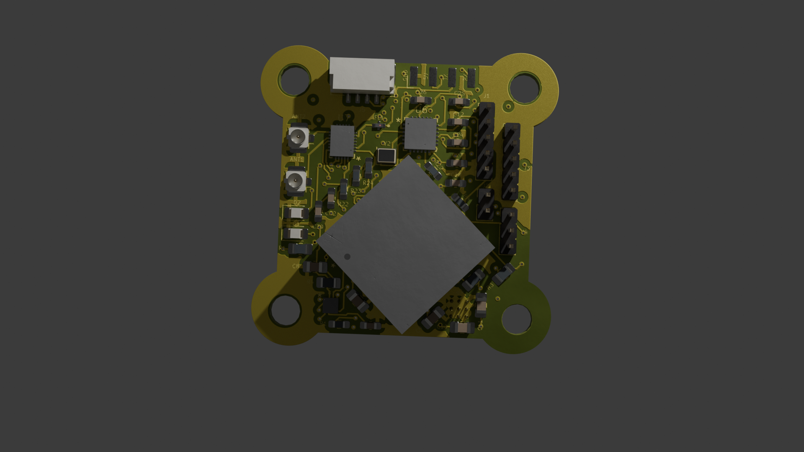

# V3-M10Q-LSM

Antenna Diversity 
(GPS: SAM-M10Q, MAG: LSM303AH, ELRS:2.4GHz_RX)

## Bill of Materials

| **Reference**   | **Value**          | **Datasheet** | **Footprint**                                             | **Qty** | **DNP** |
|------------------|--------------------|---------------|----------------------------------------------------------|---------|---------|
| **AE1**         | Antenna            | ~             | RF_Antenna:Texas_SWRA117D_2.4GHz_Right                   | 1       |         |
| **ANT1, ANT2**  | Conn_Coaxial       | ~             | Connector_Coaxial:U.FL_Hirose_U.FL-R-SMT-1_Vertical      | 2       |         |
| **B1**          | MS621FEFL11E       | MS621FEFL11E  | MS621FE-FL11E:MS621FE-FL11E                              | 1       |         |
| **C1**          | 220nF             | ~             | Capacitor_SMD:C_0603_1608Metric_Pad1.08x0.95mm_HandSolder| 1       |         |
| **C2, C6, C9, C13, C21** | 10uF   | ~             | -- mixed values --                                       | 5       |         |
| **C3, C4, C5, C7, C8, C12** | 0.1uF | ~            | -- mixed values --                                       | 6       |         |
| **C10**         | 1uF               | ~             | Capacitor_SMD:C_0805_2012Metric_Pad1.18x1.45mm_HandSolder| 1       |         |
| **C11**         | 47uF              | ~             | Capacitor_SMD:C_0805_2012Metric_Pad1.18x1.45mm_HandSolder| 1       |         |
| **C14–C20, C24, C28, C31** | 100nF | ~            | -- mixed values --                                       | 10      |         |
| **C22, C23, C29, C30** | 10pF       | ~             | -- mixed values --                                       | 4       |         |
| **C25, C26**    | 10nF              | ~             | Capacitor_SMD:C_0603_1608Metric_Pad1.08x0.95mm_HandSolder| 2       |         |
| **C27**         | 470nF             | ~             | Capacitor_SMD:C_0603_1608Metric_Pad1.08x0.95mm_HandSolder| 1       |         |
| **C32**         | 2.2uF             | ~             | Capacitor_SMD:C_0603_1608Metric_Pad1.08x0.95mm_HandSolder| 1       |         |
| **D1, D2**      | LED               | ~             | LED_SMD:LED_0805_2012Metric_Pad1.15x1.40mm_HandSolder    | 2       |         |
| **FL1**         | 2450FM07D0034T    | [Datasheet](https://www.mouser.co.uk/datasheet/2/611/2450FM07D0034-1375634.pdf) | 2450FM07D0034T:2450FM07D0034T | 1 | |
| **J1, J3**      | Conn_01x05_Pin    | ~             | Connector_PinHeader_2.00mm:PinHeader_1x05_P2.00mm_Vertical| 2       |         |
| **J2**          | Conn_01x02_Pin    | ~             | Connector_PinHeader_2.00mm:PinHeader_1x02_P2.00mm_Vertical| 1       |         |
| **J4**          | Conn_01x03_Pin    | ~             | Connector_PinHeader_2.00mm:PinHeader_1x03_P2.00mm_Vertical| 1       |         |
| **J5**          | Conn_01x04_Pin    | ~             | Connector_JST:JST_GH_SM04B-GHS-TB_1x04-1MP_P1.25mm_Horizontal| 1    |         |
| **J6**          | Conn_01x04_Socket | ~             | Connector_Harwin:Harwin_M20-89004xx_1x04_P2.54mm_Horizontal| 1      |         |
| **JP1**         | Jumper_2_Bridged  | ~             | Jumper:SolderJumper-2_P1.3mm_Open_RoundedPad1.0x1.5mm     | 1       |         |
| **R1, R5, R16** | 1K                | ~             | -- mixed values --                                       | 3       |         |
| **R2, R3**      | 1.5K              | ~             | Resistor_SMD:R_0805_2012Metric_Pad1.20x1.40mm_HandSolder | 2       |         |
| **R4**          | 4.7K              | ~             | Resistor_SMD:R_0805_2012Metric_Pad1.20x1.40mm_HandSolder | 1       |         |
| **R6–R15**      | 0                 | ~             | -- mixed values --                                       | 10      |         |
| **R17–R20, R22**| 10K               | ~             | -- mixed values --                                       | 5       |         |
| **R21**         | 12K               | ~             | Resistor_SMD:R_0603_1608Metric_Pad0.98x0.95mm_HandSolder | 1       |         |
| **R23**         | 2.2K              | ~             | Resistor_SMD:R_0603_1608Metric_Pad0.98x0.95mm_HandSolder | 1       |         |
| **R24**         | 1.2K              | ~             | Resistor_SMD:R_0603_1608Metric_Pad0.98x0.95mm_HandSolder | 1       |         |
| **U1**          | LSM303AHTR        | LSM303AHTR    | LSM303AHTR:LSM303AHTR                                    | 1       |         |
| **U2**          | SAM-M10Q-00B      | SAM-M10Q-00B  | SAM-M10Q-00B:SAM-M10Q_UBL                                 | 1       |         |
| **U3**          | BAT54STA          | BAT54STA      | SOT23_BAT54STA_1P7XP85_DIO                                | 1       |         |
| **U4**          | TPS7A4701xRGW     | [Datasheet](https://www.ti.com/lit/ds/symlink/tps7a47.pdf) | Package_DFN_QFN:Texas_RGW0020A_VQFN-20-1EP_5x5mm | 1  | |
| **U5**          | ESP8285H16        | ESP8285H16    | ESP8285H16:QFN32_5X5_EXP                                  | 1       |         |
| **U6**          | SX1280IMLTRT      | SX1280IMLTRT  | SX1280IMLTRT:QFN24_4X4_SEM                                | 1       |         |
| **U7**          | SE2431L-R         | SE2431L-R     | SE2431L-R:SE2431L_SKY                                     | 1       |         |
| **Y1**          | 26MHz             | ~             | Crystal:Crystal_SMD_2016-4Pin_2.0x1.6mm                   | 1       |         |
| **Y2**          | 52MHz             | ~             | Crystal:Crystal_SMD_2016-4Pin_2.0x1.6mm                   | 1       |         |

[⬅️ Go Back to Main README](https://github.com/Paschalis/fc-plus-sensor-module)