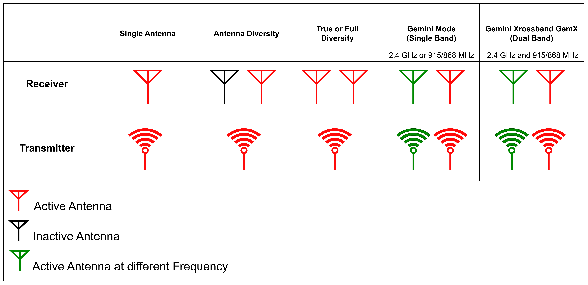

# Transmission Modes Classification

This document describes various transmission modes used in long-range LoRa (Long Range) wireless communication for drones. These modes leverage LoRa's unique capabilities to improve Signal Quality (LQ), mitigate interference, and enhance reliability over extended distances, making them ideal for drone applications in diverse environments.
## Transmission Modes

### 1. Single Antenna
- **Description**:  
  Uses one antenna on both the transmitter and receiver, operating over a single frequency channel.
- **Advantages**:  
  - Simplicity  
  - Low cost  
- **Limitations**:  
  - Highly susceptible to interference and signal loss.  

### 2. Antenna Diversity

- **Description**:  
  The receiver employs two antennas to select the best signal, while the transmitter uses a single antenna. Communication occurs over a single frequency channel.  
- **Advantages**:  
  - Improved signal quality due to antenna selection.  
- **Limitations**:  
  - Only one frequency channel is used.  
  - Transmission lacks diversity.  

### 3. True Diversity or Full Diversity
- **Description**:  
  Both the transmitter and receiver utilize two independent Semtech LoRa chips, each connected to its own antenna, operating on the same frequency. This setup provides full diversity for both transmitting and receiving.  
- **Advantages**:  
  - Enhanced signal quality through full transmitter and receiver diversity.  
  - Redundancy in signal transmission and reception.  
- **Limitations**:  
  - Increased complexity and cost.  

### 4. Gemini Mode (Single Band)
- **Description**:  
  The transmitter sends packets on two frequencies within the same band (e.g., 2.4 GHz or 900 MHz), spaced approximately 40 MHz apart for 2.4 GHz and 10 MHz apart for 900 MHz. A true diversity receiver with two antennas and LoRa chips receives both signals simultaneously.  
- **Advantages**:  
  - Superior interference mitigation by utilizing two frequencies within the same band.  
  - Improved stability and reliability of signal quality.  
- **Limitations**:  
  - Limited to a single frequency band.  

### 5. Gemini Xrossband GemX (Dual Band)
- **Description**:  
  The transmitter operates simultaneously on two different frequency bands (e.g., 2.4 GHz and 900 MHz), each managed by independent LoRa chips. The receiver employs true diversity hardware with two antennas and LoRa chips operating on distinct bands.  
- **Advantages**:  
  - Enhanced interference avoidance by operating across separate bands.  
  - Increased performance and redundancy for long-range communication.  
- **Limitations**:  
  - More complex and expensive hardware due to dual-band operation.  

---

## Transmission Mode Classification Chart

| Mode                        | Frequency Channels      | Antennas (TX) | Antennas (RX)| Interference Mitigation | Signal Quality  | Receiver Type        |
|-----------------------------|-------------------------|---------------|---------------|-------------------------|-----------------|----------------------|
| **Single Antenna**          | 1                      | 1             | 1             | Low                     | Low             | Simple Receiver      |
| **Antenna Diversity**       | 1                      | 1             | 2             | Moderate                | Moderate        | Diversity Receiver   |
| **True Diversity or Full Diversity**  | 1                      | 1             | 2             | High                    | High            | Diversity Receiver   |
| **Gemini Mode (Single Band)**| 2 (within 1 band)     | 2        | 2             | Very High               | Very High       | Diversity Receiver   |
| **Gemini Xrossband GemX (Dual Band)** | 2 (across 2 bands)     | 2             | 2                | Excellent               | Excellent       | Dual-band Receiver   |

---

## Summary

This classification illustrates the progression from basic single antenna setups to advanced true diversity and dual-band configurations:

- **Single Antenna** and **Antenna Diversity** provide fundamental solutions suitable for simple environments.  
- **True Diversity** or **Full Diversity** and **Gemini Mode (Single Band)** offer significant enhancements in reliability and interference mitigation within the same band.  
- **Gemini Xrossband GemX (Dual Band)** delivers optimal performance by leveraging dual-band communication, ideal for complex and interference-prone environments.  

Understanding these modes enables the selection of appropriate communication systems tailored to specific drone operation requirements, ensuring robust and efficient wireless links.

---

## References

- [mLRS GitHub Repository](https://github.com/olliw42/mLRS)  
- [mLRS Documentation](https://github.com/olliw42/mLRS-docu)  
- [mLRS Hardware Repository](https://github.com/olliw42/mLRS-hardware/tree/master)  
- [ArduPilot: mLRS RC Overview](https://ardupilot.org/copter/docs/common-mlrs-rc.html)  
- [ExpressLRS: Gemini Overview](https://www.expresslrs.org/software/gemini/)  
- [ExpressLRS Documentation](https://www.expresslrs.org/)  

[⬅️ Go Back to Main README](../README.md)